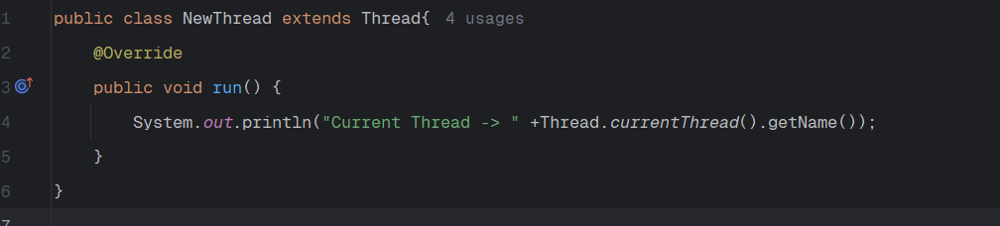
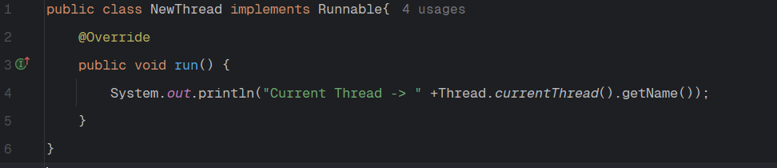
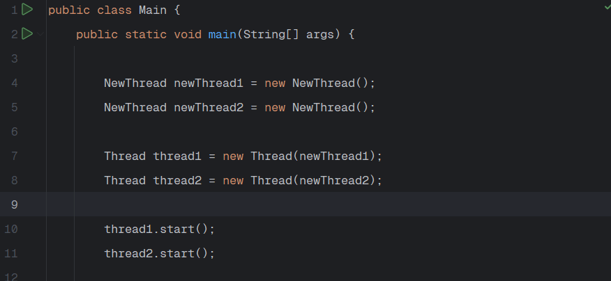

In Java, you can create a thread in two ways - 

    1. Extend the "Thread" class
    2. Implement the "Runnable" interface

# EXTENDING THE "THREAD" CLASS

When we extend the "Thread" class, we have to implement a method named "run" and in that method, we have to write the code that we want to be executed in a separate thread, not in main thread.

Now, let's say we create a new object of this "NewThread" in the main method. -

    NewThread newThread = new NewThread();

You might think that we need to write - 

    newThread.run();

But if you do this, you will see that in the terminal, it will say - 

    Current Thread - main

It means, when we called "run" then also the code is running in the same "main" thread. But, we do not want that. We want the code to run in a separate thread.

And that's why, instead of "run()" we have to call "start()" - 

    newThread.start();

Now, the terminal will say - 

    Current Thread -> Thread-0

And now, this code is running in a separate thread.

Can we run "start()" more than once?

If you write -

        newThread.start();
        newThread.start();

There won't be any compiler warning or error. But, when you run the code, you will get an exception - 

    Exception in thread "main" java.lang.IllegalThreadStateException

That's because a thread can be started at most once. You cannot call the start method more than once on the same object of a class that extends "Thread".

Note that we said "same object". It means, if we have - 

    NewThread newThread1 = new NewThread();
    NewThread newThread2 = new NewThread();
    
    newThread1.start();
    newThread2.start();

This will be a valid code and it will print -

    Current Thread -> Thread-0
    Current Thread -> Thread-1

So now, there are three threads in our program - "main", "Thread-0" and "Thread-1".

# IMPLEMENTING THE "RUNNABLE" INTERFACE

Another way to create a Thread is to implement the "Runnable" interface and then implement the "run" method in the same way as we did above.

Doesn't look like there is much difference, right?

Well, if we now go in our main class, the compiler starts showing an error where we called "start" method. Because, on a "Runnable" interface, there is no method named "start". This is just a simple Functional Interface with one method named "run".

    @FunctionalInterface
    public interface Runnable {
        void run();
    }

So, how do we run the code in a new thread now?

Well, we have to pass this class's object that implements Runnable inside a "Thread" constructor.

# THREAD VS RUNNABLE

As we know, Java does not support multiple inheritance. It means, if there is a class that is already extending another class, then ofcourse we cannot extend "Thread" class in this case. We can only implement "Runnable" in this case.

Usually, the preferred way is to "implement" the Runnable interface. In this way, we can extend another class as well.

In Object-oriented programming, extending a class generally means, adding new functionality, and modifying or improving behaviors. If we are not making any modification on Thread then use Runnable interface instead.
