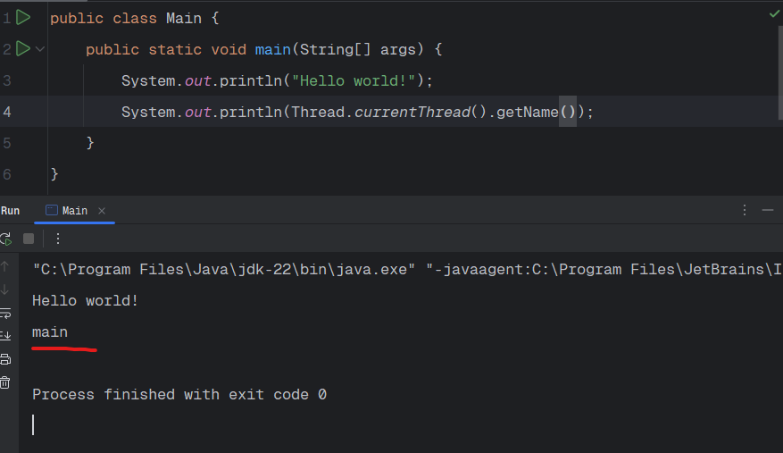

Java provides robust support for multithreading, allowing the developers to create applications that can perform multiple tasks simultaneously, improving performance and responsiveness.

In Java, multithreading is the concurrent execution of two or more threads to maximize the utilization of the CPU. Java's multithreading capabilities are part of the "java.lang" package, making it easy to implement concurrent execution.

In a single-core environment, the Java's multithreading is managed by the JVM and the OS, which switch between threads to give the illusion of concurrency.

The threads share the single core, and time-slicing is used to manage thread execution.

In a multi-core environment, the Java's miltithreading can take full advantage of the available cores. The JVM can distribute threads across multiple cores, allowing a true parallel execution of threads.

A thread is a lightweight process, the smallest unit of processing. Java supports multithreading through its "java.lang.Thread" class and the "java.lang.Runnable" interface.

When you start a Java program, one thread begins running immediately which is named "main". This is the thread that is responsible for executing the main method of a program.

And to see this, try to print the "Thread.currentThread().getName()" in the console which will give you the name of the current thread.